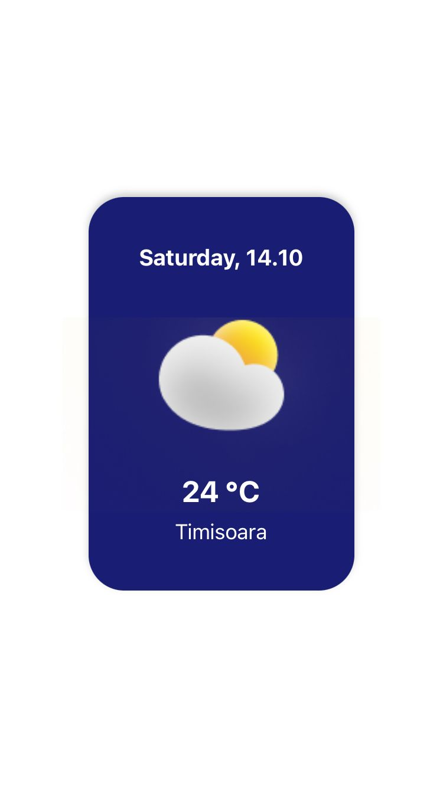
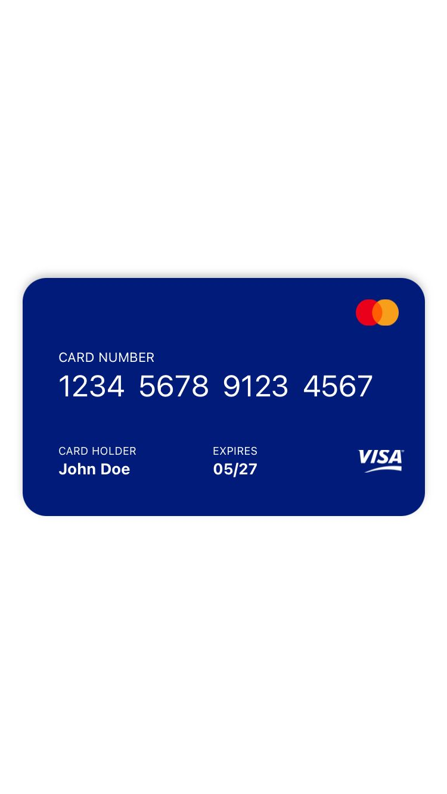

# mobile_applications_ws
<h2>What I've done using JavaScript and React Native</h2>

From 99 JavaScript exercises I've completed more than 50, exercising my knowledge in JavaScript.These exercises helped me understand how to use functions, methods and objects.

At the first introductive workshop for React Native I've learned how to edit a text.

In the 2nd workshop of React I've learned how to make  basic components such as: Text inputs, buttons.

As a homework I've created multiple components to expand and develop my skills.

The components I've created are the following:

<ul>
  <li>City card</li>
   
  <li>Badge</li>
   
  <li>Downloader</li>
   
  <li>Weather card</li>
   
  <li>Header</li>
   
  <li>Visa card</li>
   
  <li>Login screen</li>
    
</ul>

